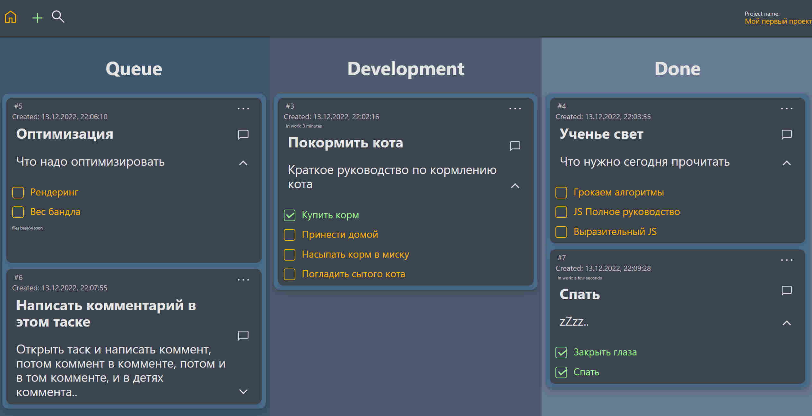
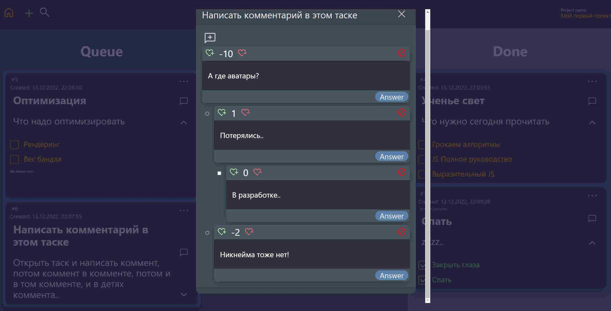

# Проект "Task-board" - тестовое задание одной из вакансий Frontend-разработчика

## Ссылка на проект https://navfront.github.io/Task-board/

### Что реализовано:

- [x] Страница с выбором проекта
- [x] Страница с задачами
- [x] Все действия должны происходить в модальных окнах
- [x] Страница с задачами должна содержать в себе три колонки c возможностью изменения статуса с помощью drag-n-drop:
  - [x] Queue
  - [x] Development
  - [x] Done
- [x] Каждая задача имеет:
  - [x] Номер задачи
  - [x] Заголовок
  - [x] Описание
  - [x] Дата создания
  - [x] Время в работе
  - [x] Текущий статус
  - [x] Возможность добавлять подзадачи;
  - [x] Система каскадных комментариев
- [x] Возможность создавать задачу
- [x] Возможность редактирования задачи
- [x] Даже если все подзадачи выполнены, это не значит, что и основная становится выполненной
- [x] Поиск по номеру задачи и заголовку
- [x] Адаптация под мобильные устройства
- [x] Анимации \ отзывчивость сайта на действия юзера
- [x] Приложение должно сохранять все данные после перезагрузки страницы
- [x] Развернуть на хостинге

## Стек:

- Create-React-App
- React-Router-Dom
- Redux-Saga
- Typescript
- React-Helmet-Async
- Redux\React-redux
- Scss
- Eslint\Prettier
- React-dnd (drag-n-drop)
- React-dnd-html5-backend
- React-dnd-touch-backend
- React-quill (WYSIWYG)
- Dayjs
